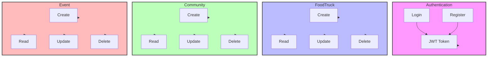
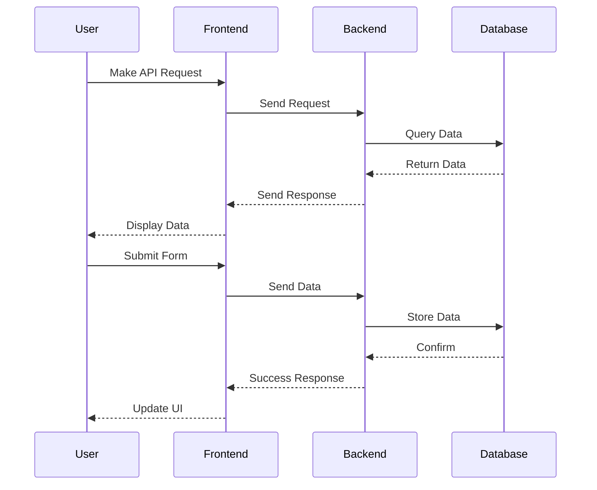

# Project Architecture

```mermaid
graph TD
    subgraph Frontend[React Frontend]
        UI[React Components]
        State[Redux Store]
        API[API Client]
        UI --> State
        State --> API
    end

    subgraph Backend[Spring Boot Backend]
        Controllers[REST Controllers]
        Services[Business Services]
        Repositories[Data Repositories]
        Controllers --> Services
        Services --> Repositories
    end

    subgraph Database
        H2[In-Memory H2 Database]
    end

    subgraph External Services
        AWS[AWS Services]
        AWS --> "S3 Storage"
        AWS --> "CloudWatch"
    end

    Frontend --> Backend
    Backend --> Database
    Backend --> AWS

    style Frontend fill:#f9f,stroke:#333,stroke-width:2px
    style Backend fill:#bbf,stroke:#333,stroke-width:2px
    style Database fill:#bfb,stroke:#333,stroke-width:2px
    style ExternalServices fill:#fbb,stroke:#333,stroke-width:2px
```

## Component Details

### Frontend Architecture
```mermaid
graph TD
    subgraph Pages
        Dashboard[Dashboard]
        Communities[Communities]
        Events[Events]
        FoodTrucks[Food Trucks]
        Profile[Profile]
    end

    subgraph Components
        Layout[Layout]
        Navigation[Navigation]
        Cards[Card Components]
        Forms[Form Components]
    end

    subgraph State Management
        Redux[Redux Store]
        Auth[Authentication]
        UI[UI State]
    end

    Pages --> Components
    Components --> State Management
    State Management --> Redux
    Auth --> Redux
    UI --> Redux

    style Pages fill:#f9f,stroke:#333,stroke-width:2px
    style Components fill:#bbf,stroke:#333,stroke-width:2px
    style StateManagement fill:#bfb,stroke:#333,stroke-width:2px
```

### Backend Architecture


## Data Flow

